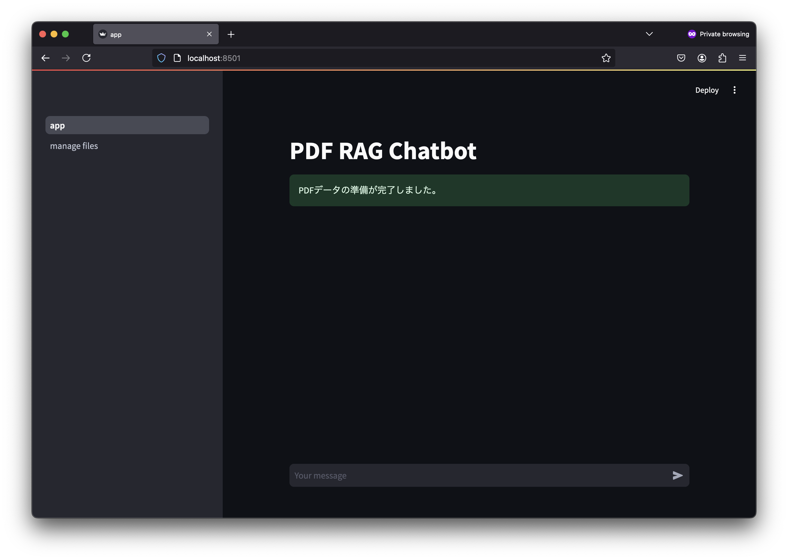
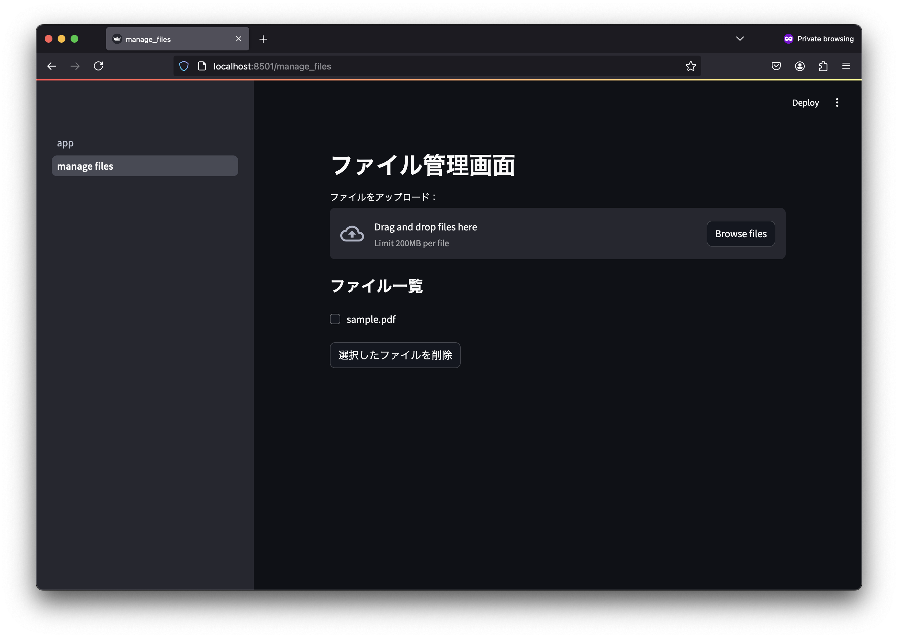

# Streamlit Tutorial Repo

<p align="center">
  
  
</p>


## Install Requirements
This app was built using Python 3.9.5
```
pip3 install -r requirements.txt
```

## Set OpenAI API Keys
in the file `/.env`, specify your OpenAI API key.
```bash
OPENAI_API_KEY = "YOUR OPEN AI API KEY HERE"
```

## Run the app
```
streamlit run app.py
```

## Upload PDF files 
You can upload PDF files via the "manage files" tab in the application GUI, or by directly placing PDF files under the `/documents/` directory.